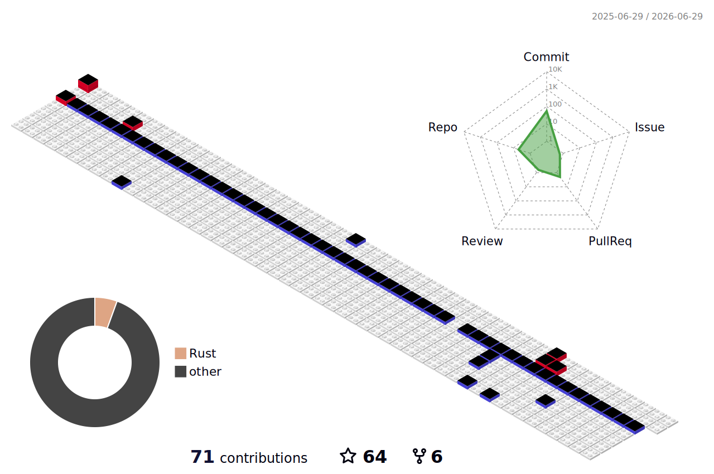

<div align="center">
    
[](https://git.io/typing-svg)

</div>

<div align="center">
    
[](https://git.io/typing-svg)

</div>


## 🤡 Brief Introduction

<p></p>


- 👋 Hi, I’m **无邪**，a postgraduate student of CQUPT
- 👀 I’m interested in AI、Backend and ...
- 🌱 I’m currently learning Go、Rust and ...
- 💞️ [OSPP](https://summer-ospp.ac.cn/) 2024学生参与者
-  微信公众号：小菜先生的编程随想 👏🏻欢迎关注，一起进步
- 🎈 博客园：https://www.cnblogs.com/swx123/



## 🎈 Blog posts
<!-- BLOG-POST-LIST:START -->
 - 💫[大厂文章学习《DDD在大众点评交易系统演进中的应用》 - 思wu邪 Sun Aug 31 2025 7:55 AM](https://www.cnblogs.com/swx123/p/19066946/dachang-s-article-study-the-application-of-ddd-in-the-evolution-of-dianping-trading-system-z2vfpnf) 
 - 【摘要】大厂文章学习：大众点评通过DDD对交易系统进行领域拆解与建模，利用限界上下文、防腐层等模式隔离变化，最终通过分层架构将领域模型映射为代码实现，提升了复杂业务的应对能力。 &lt;a href=&quot;https://www.cnblogs.com/swx123/p/19066946/dachang-s-... 

 - 🦧[从零构建搜索引擎 build demo search engine from scratch - 思wu邪 Mon Jul 14 2025 3:22 PM](https://www.cnblogs.com/swx123/p/18984825/build-demo-search-engine-from-scratch-1aai6n) 
 - 【摘要】揭秘搜索引擎瞬间海量搜索的秘密！一文搞懂倒序索引原理，开源Demo上线GitHub：支持AND/OR查询！ &lt;a href=&quot;https://www.cnblogs.com/swx123/p/18984825/build-demo-search-engine-from-scratch-1aa... 

 - 💫[并发下正确的FirstOrCreate数据库操作 - 思wu邪 Wed Jun 25 2025 3:31 PM](https://www.cnblogs.com/swx123/p/18949056/concurrently-the-correct-firstorcreate-database-operation-is-done-z24qege) 
 - 【摘要】你是否以为用了FirstOrCreate就万事大吉？大错特错！在高并发的环境下，这个操作竟成了重复数据和系统崩溃的元凶！本文将揭露并发场景下FirstOrCreate的致命陷阱，并给出终极解决方案 &lt;a href=&quot;https://www.cnblogs.com/swx123/p/18949... 

 - 💫[singlefligt使用方法和源码解读 - 思wu邪 Wed Jun 18 2025 2:26 PM](https://www.cnblogs.com/swx123/p/18935444/singlefligt-usage-method-and-source-code-interpretation-zocygn) 
 - 【摘要】singlefligt使用方法和源码解读 &lt;a href=&quot;https://www.cnblogs.com/swx123/p/18935444/singlefligt-usage-method-and-source-code-interpretation-zocygn&quot; target=&quot;_b... 

 - 💯[极客时间《后端存储实战课》阅读笔记 - 思wu邪 Sun Jun 15 2025 2:16 PM](https://www.cnblogs.com/swx123/p/18930256/geek-time-backend-storage-practical-course-reading-notes-2fudls) 
 - 【摘要】极客时间《后端存储实战课》阅读笔记。。。 &lt;a href=&quot;https://www.cnblogs.com/swx123/p/18930256/geek-time-backend-storage-practical-course-reading-notes-2fudls&quot; target=&quot;_... 
<!-- BLOG-POST-LIST:END -->


## ✨ Other
<!--START_SECTION:waka-->

```rust
From: 14 February 2026 - To: 16 March 2026

Total Time: 139 hrs 16 mins

Other            107 hrs 12 mins       >>>>>>>>>>>>>>>>>>>------   76.98 %
Go               20 hrs 14 mins        >>>>---------------------   14.54 %
PHP              5 hrs 4 mins          >------------------------   03.65 %
Siyuan           1 hr 46 mins          -------------------------   01.27 %
Markdown         1 hr 34 mins          -------------------------   01.13 %
HTTP Request     1 hr 11 mins          -------------------------   00.85 %
IDL              1 hr 3 mins           -------------------------   00.76 %
YAML             16 mins               -------------------------   00.19 %
JSON             14 mins               -------------------------   00.17 %
Text             10 mins               -------------------------   00.12 %
```

<!--END_SECTION:waka-->


[](https://github.com/ryo-ma/github-profile-trophy)

[^_^]:
    commentted-out contents
    should be shift to right by four spaces (`>>`).


    

     &nbsp;&nbsp;&nbsp;&nbsp;

    <!---
    [https://github.com/anuraghazra/github-readme-stats/blob/master/docs/readme_cn.md](https://www.yuque.com/achuan-2/blog/dq718n)
    --->
    <div align="center">
    <span>  </span>
    <span>  </span>
    <span>  </span>
    </div>
    
    <div align="center">
    <!--     [](https://github.com/ashutosh00710/github-readme-activity-graph) -->
        
    <!--      -->
    </div>
    
    
    <picture>
      <source media="(prefers-color-scheme: dark)" srcset="https://raw.githubusercontent.com/578223592/578223592/output/github-contribution-grid-snake-dark.svg">
      <source media="(prefers-color-scheme: light)" srcset="https://raw.githubusercontent.com/578223592/578223592/output/github-contribution-grid-snake.svg">
      
    </picture>
