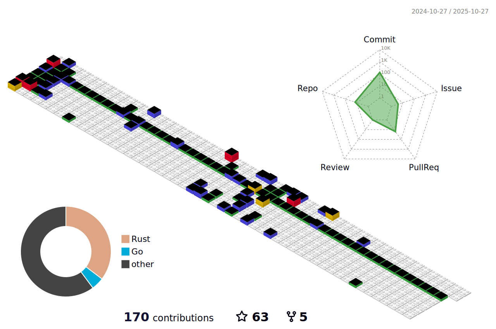

<div align="center">
    
[](https://git.io/typing-svg)

</div>

<div align="center">
    
[](https://git.io/typing-svg)

</div>


## 🤡 Brief Introduction

<p></p>


- 👋 Hi, I’m **无邪**，a postgraduate student of CQUPT
- 👀 I’m interested in AI、Backend and ...
- 🌱 I’m currently learning Go、Rust and ...
- 💞️ [OSPP](https://summer-ospp.ac.cn/) 2024学生参与者
-  微信公众号：小菜先生的编程随想 👏🏻欢迎关注，一起进步
- 🎈 博客园：https://www.cnblogs.com/swx123/



## 🎈 Blog posts
<!-- BLOG-POST-LIST:START -->
 - 💫[Golang sync.pool源码解析 - 思wu邪 Fri Jan 24 2025 6:05 AM](https://www.cnblogs.com/swx123/p/18689447/golang-syncpool-source-code-analysis-1xpgw6) 
 - 【摘要】sync.Pool 是 Go 中用于对象复用的工具，可减少频繁创建和销毁对象的开销，从而优化内存使用和降低 GC 压力。本文通过分析其用法、真实案例及源码结构，详细解读了 sync.Pool 的读写流程及其背后的高效设计思想，为性能优化提供了实用参考。 &lt;a href=&quot;https://ww... 

 - 🦧[【大厂文章学习】合并编译的学习与思考 - 思wu邪 Wed Jan 22 2025 12:46 PM](https://www.cnblogs.com/swx123/p/18686774/learning-from-the-large-factory-article-the-study-and-thinking-of-combined-compilation-jva2s) 
 - 【摘要】合并编译通过将微服务的远程调用优化为本地函数调用，显著降低CPU开销和容器资源需求，但需权衡服务隔离、版本管理等挑战，适用于资源密集、调用关系紧密的场景。 &lt;a href=&quot;https://www.cnblogs.com/swx123/p/18686774/learning-from-the... 

 - 💫[对rpc长连接与短连接的思考 - 思wu邪 Thu Jan 16 2025 1:34 PM](https://www.cnblogs.com/swx123/p/18675793/think-about-the-rpc-long-connection-and-short-connection-zufhzj) 
 - 【摘要】RPC项目中长连接和短连接各有优劣，长连接适用于少量客户端，提高效率；短连接则更适合大量客户端，避免服务器过载。结合L4和L7负载均衡，合理选择连接方式，提升系统性能和稳定性。 &lt;a href=&quot;https://www.cnblogs.com/swx123/p/18675793/think-... 

 - 💫[从源码解析golang Timer定时器体系的来龙去脉 - 思wu邪 Mon Jan 06 2025 3:41 PM](https://www.cnblogs.com/swx123/p/18656562/timer-ticker-use-and-its-precautions-4mx1q) 
 - 【摘要】在 Golang 中，Timer 和 Ticker 是常用的定时器工具，但它们的使用易出错，尤其是初学者。本文将深入探讨定时器的正确使用方式、常见误区，并通过源码解读帮助你更好地理解它们的工作原理。 &lt;a href=&quot;https://www.cnblogs.com/swx123/p/1865... 

 - 💯[golang1.23版本之前 Timer Reset方法无法正确使用 - 思wu邪 Sun Jan 05 2025 4:45 PM](https://www.cnblogs.com/swx123/p/18654198/golang123-before-the-timer-reset-method-cannot-be-used-correctly-z1irvwa) 
 - 【摘要】在 Go 1.23 之前，正确使用 Timer.Reset 是一个挑战，因为 Stop 和抽取操作之间的状态可能不一致，导致定时器异常触发。最好的做法是避免复用定时器，每次都创建一个新的定时器，这样代码更简洁、健壮，也更容易维护。 &lt;a href=&quot;https://www.cnblogs.c... 
<!-- BLOG-POST-LIST:END -->


## ✨ Other
<!--START_SECTION:waka-->

```rust
From: 04 January 2025 - To: 03 February 2025

Total Time: 167 hrs 12 mins

Other                109 hrs 26 mins >>>>>>>>>>>>>>>>---------   65.45 %
Go                   22 hrs 42 mins  >>>----------------------   13.58 %
Siyuan               19 hrs 37 mins  >>>----------------------   11.74 %
PHP                  12 hrs 4 mins   >>-----------------------   07.23 %
Rust                 2 hrs 27 mins   -------------------------   01.47 %
IDL                  22 mins         -------------------------   00.22 %
Markdown             11 mins         -------------------------   00.12 %
TOML                 6 mins          -------------------------   00.07 %
go.mod               3 mins          -------------------------   00.04 %
Text                 3 mins          -------------------------   00.04 %
```

<!--END_SECTION:waka-->


[](https://github.com/ryo-ma/github-profile-trophy)

[^_^]:
    commentted-out contents
    should be shift to right by four spaces (`>>`).


    

     &nbsp;&nbsp;&nbsp;&nbsp;

    <!---
    [https://github.com/anuraghazra/github-readme-stats/blob/master/docs/readme_cn.md](https://www.yuque.com/achuan-2/blog/dq718n)
    --->
    <div align="center">
    <span>  </span>
    <span>  </span>
    <span>  </span>
    </div>
    
    <div align="center">
    <!--     [](https://github.com/ashutosh00710/github-readme-activity-graph) -->
        
    <!--      -->
    </div>
    
    
    <picture>
      <source media="(prefers-color-scheme: dark)" srcset="https://raw.githubusercontent.com/578223592/578223592/output/github-contribution-grid-snake-dark.svg">
      <source media="(prefers-color-scheme: light)" srcset="https://raw.githubusercontent.com/578223592/578223592/output/github-contribution-grid-snake.svg">
      
    </picture>
